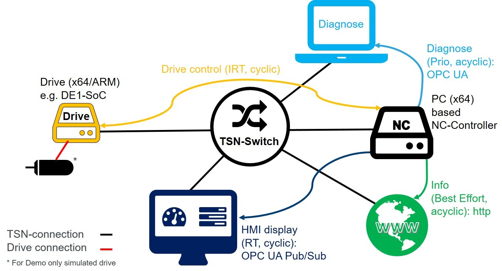

# AccessTSN Industrial Use Case Demo - Overview
Together the provided applications form a converged network use case in an industrial setting. An overview of the use case is in the following figure.

The use case describes a basic milling machine with three (simulated) axis. Apart from the main control and the drives, an HMI is present. Additionally, the machine offers an OPC UA server as a diagnostic interface and a web-interface displaying trend data. Within this machine there are four different types of communication relationships with different priorities.
* **Real-time drive control:** The main control and the drive control form a real-time control loop. This cyclic control traffic has the highest deterministic requirements. It uses raw Ethernet Sockets. The Demo Applications modelling the main and the drive control are based on the “Simple RT application”-How to available at the Linux Foundation Wiki. These applications show a low-level example of the usage of the TSN features.
* **Real-time OPC UA Pub/Sub HMI:** The control data of the main control is also communicated to a basic HMI. This type of traffic if also cyclic but with lower requirements than the drive control. The HMI data is modelled using OPC UA and transported using OPC UA Pub/Sub messages. The “open62541”-project is used for the OPC UA implementations and the Publisher and HMI-Demos are based on their RT-Publisher-Example available at the “open62541”-Repository.
* **Diagnosis via OPC UA (Server/Client):** As a diagnostic interface for the main control, a OPC UA server is used. This acyclic traffic is modelled as prioritized compared to Best-Effort traffic. The data is transported as standard OPC UA communication over UDP. The implementation of the OPC UA sever utilizes the “open62541”-Project and is based on the examples of the project. As a client, any OPC UA client software can be used.
* **Trend and monitoring data:** To include Best-Effort-Traffic in the use case, a web-interface showing current and trend data of the main control is included. This communication uses standard http-packets. The Demo Application uses the combination of InfluxDB and Grafana to display the data. Any current browser can be used as client.