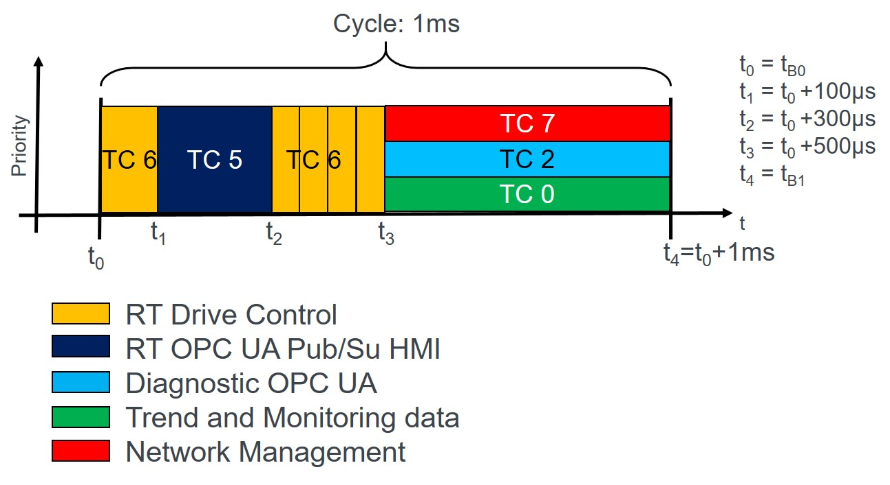

# AccessTSN Industrial Use Case Demo - Traffic Schedule

As of November 2020 a dynamic or automatic configuration of a TSN network is not yet possible since implementation of basic components and definition of necessary protocols are missing. This is especially the case for a Linux based endpoint. Therefore the AccessTSN Industrial Use Case Demo uses a fixed network traffic schedule which is configured through local configuration on each device. Some of this configuration is passed to the applications though the command line or hardcoded as assumption in the application. 

## Types of traffic in the Use Case
Each of the communication relationships introduced in the overview has it's own type of traffic. In addition to the traffic of the mentioned communication relationships the required network management  also produces it's own type of traffic (e.g. PTP-messages). The types of traffic differ by the required priority of the packet transmission as well as the amount and size of packets. Also the periodicity is not identical. The following table shows the traffic types of the communication relationships as well as the used traffic classes. This categorization ans mapping is based on the  "*TSn Testbed Characterization and Mapping of Converged Traffic Types*"-Whitepaper of the Industrial Internet Consortium (IIC) available at: <https://www.iiconsortium.org/pdf/IIC_TSN_Testbed_Char_Mapping_of_Converged_Traffic_Types_Whitepaper_20180328.pdf>

| Com. Relationship     | Traffic type           | Traffic class  |
| --------------------- |:----------------------:| --------------:|
| RT drive control      | Isochronous            |    6 |
| RT OPC UA Pub/Sub HMI | Cyclic (Option: Scheduled)                |    5 |
| Diagnostic OPC UA     | Config & Diagnostics   |    2 |
| Trend and Monitoring data | Best Effort        |    0 |
| Network Management    | Network Control        |    7 |

## Network Schedule
For the Industrial Use Case Demo a simple network schedule was chosen. Only a network wide schedule is specified to keep things simple. The specified time slots are rather relaxed with more than enough time for the transmitted cyclic data. Since it is assumed that the length of the used cables are short and not many switches are used, the transmission delay is neglected and a special schedule for each device is omitted. The schedule should be manageable with 1000 and 100 MBit/s devices. As the RT drive control is set up as 1 ms periodic stream and the cyclic HMI traffic can be adjusted, the period of the schedule is specified to 1 ms. The following figure shows the network-wide schedule for the use case.

At the start of the cycle an exclusive gate for the communication from the control to the drives (traffic class 6) with a duration of 100µs is specified. Afterwards follows an exclusive gate for thr HMI traffic (traffic class  5) with a duration of 200µs. For the next 200µs another exclusive gate for the traffic from the four drives to the control (traffic class 6) is specified. The rest of the cycle (500µs) is shared between the diagnostic, monitoring and network traffic (traffic classes 2; 0 and 7 respectively). Here strict priority between the traffic types is specified. As of November 2020 this is not yet completely configurable since according to 802.1AS-2011 PTP-frames should not have a VLAN-tag with the priority field and the newer 802.1AS-2020 is not net implemented in the used LinuxPTP. The switch used for the Use Case setup might have a different way to priorities PTP-frames; this si out of scope of this documentation and needs to be checked in each case.

From this network schedule the gate-control-list for the central switch of the use case demo setup is derived. The gate-control-list can be found in the switch-configuration file in the *config* subdirectory. 